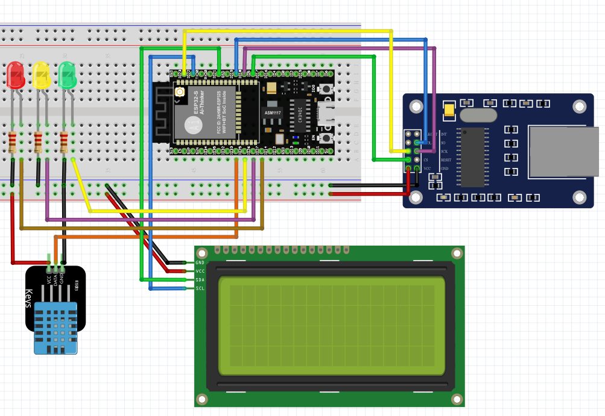

# ESP32_UIPEthernet_thingspeak




  
 
   


## POST - Add a TalkBack Command
```js
POST /talkbacks/47146/commands.json?api_key=OSZC0RZD8PZFWLZX HTTP/1.1
Host: api.thingspeak.com
Accept: application/json
Content-Type: text/html
Content-Length: 21

command_string=3_OFF
```

## GET - List All TalkBack Commands
```js
GET /talkbacks/47146/commands.json?api_key=OSZC0RZD8PZFWLZX HTTP/1.1
Host: api.thingspeak.com
Accept: application/json
```

## DELETE - Delete All TalkBack Commands
```js
DELETE /talkbacks/47146/commands.json?api_key=OSZC0RZD8PZFWLZX HTTP/1.1
Host: api.thingspeak.com
Accept: application/json
```
