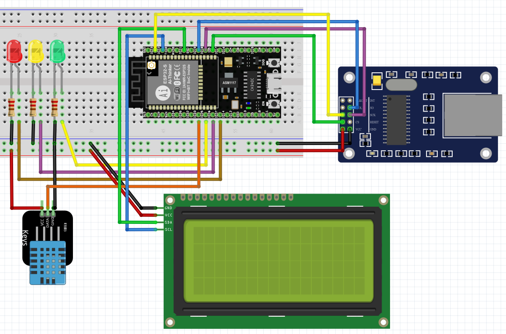

# ESP32_UIPEthernet_thingspeak




[POST Requests Online](https://reqbin.com/post-online) 

[Thingspeak ](https://thingspeak.com/channels/1623046)

## 材料:

| 名稱  | 數量  |
| :------------ |:---------------:|
| NodeMCU-32S 1.3 | 1 | 
| USB 傳輸線      | 1 |  
| DHT11模組 | 1 |
| ENC28J60 網路模組 | 1 |
| LCD2004 I2C 顯示模組 | 1 |
| 杜邦線 | 1 |
| LED    | 3 |

***
## 使用到的函式庫

 

 
  
 

## POST - Add a TalkBack Command
```js
POST /talkbacks/4714X/commands.json?api_key=OSZC0RZD8PZFWLZX HTTP/1.1
Host: api.thingspeak.com
Accept: application/json
Content-Type: text/html
Content-Length: 21

command_string=3_OFF
```

## GET - List All TalkBack Commands
```js
GET /talkbacks/4714X/commands.json?api_key=OSZC0RZD8PZFWLZX HTTP/1.1
Host: api.thingspeak.com
Accept: application/json
```

## DELETE - Delete All TalkBack Commands
```js
DELETE /talkbacks/4714X/commands.json?api_key=OSZC0RZD8PZFWLZX HTTP/1.1
Host: api.thingspeak.com
Accept: application/json
```
